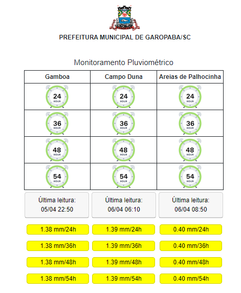
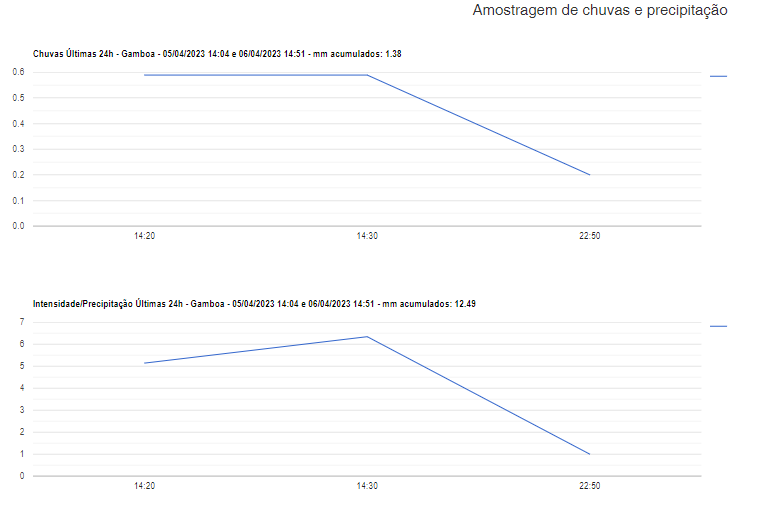

# Defesa Civil
<h4>GAROPABA - SC</h4>  
Medição de pluviômetros para controle de volumes de chuvas. 
Tecnologias utilizadas: PHP e Python 
Banco de dados: postgre
Origem dos dados: http://sws.cemaden.gov.br  
Atualização dos dados é feita instantaneamente de minuto em minuto. 
São gerados dados pluviométricos de cada pluviômetro e mostrados em um frontend PHP.  
No caso de as chuvas ultrapassarem limites pré-determinados, é enviado email para a defesa civil alertando para um excessivo de 
 chuvas em determinada região.(PHPmailer) 
Existem gráficos demonstrativos para cada volume de chuvas registrados nas últimas 24h, 36h, 48h, 54h ao clicar nos relógios correspondentes.  

Obs.: é necessário obter uma chave de acesso junto ao CEMADEN cadastrando um email e recebendo do CEMADEN uma senha para geração  
de token que será usado no consumo das API´s.

<b>IMPORTANTE: </b>Atualizar os arquivos "public/system_config.py" e "public/conect/config.php", preenchendo com as variáveis necessárias para funcionamento. 

 
Para mais informações, contatar o setor responsável através do e-mail dti@garopaba.sc.gov.br. 

